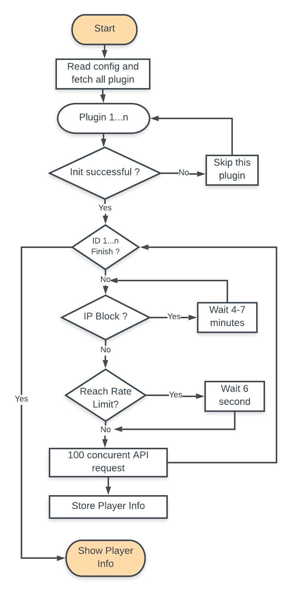

# Onefootball Assignment 

# Introduction
Go plugin system offers to build loosely coupled modular programs using packages compiled as shared object libraries that can be loaded and bound to dynamically at runtime. I choose it so that if I have to fetch same data from other source then I don't need edit the full system. I just write plguin for the new source and update the data storege part according to new requirement.

# Test Coverage
Run `make test` in the project root directory. It will generate test coverage report. Open `coverage.html` file to see the report.

# Run
Run `make run` in the project root directory. I will take some time (about 24 minutes) so please be patient. When the execution is finish, you can see the result in console. It will also store logs in `assignment_log.txt` and also result in `result.txt` file at root directory.

# Solution Overview
ID range is huge so we have to find a ID range for which API provides team details. To find the range write a program to see the response and find a the maximum ID. After the maximum ID API don't provide any team data so API request will be waste.

Synchronous request to each API will take a long time so I have choose asynchronous approach. But API is behind [Envoy Proxy](https://www.envoyproxy.io/) and rate limit. I find a rate limit using try and error approach at which I can make concurrent request to the API. I also find a waiting time perioud to unblock the IP if it gets blocked by server.

[]